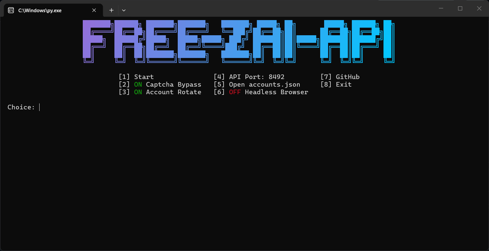

# Free-ZAI-Api




Self-hosted OpenAI-compatible API proxy for [chat.z.ai](https://chat.z.ai) (GLM-5.3 / GLM-5.2 / etc).
Runs a real browser session via **Playwright**, so the site sees a genuine Chrome fingerprint — the invisible Aliyun captcha passes automatically, no third-party captcha services needed.

> Built for use with [opencode](https://opencode.ai) and any other OpenAI-compatible client.

## How it works

```
client (opencode)                proxy (main.py)                  chat.z.ai
      │  POST /v1/chat/completions     │                               │
      │  {tools, messages, ...}        │                               │
      ├───────────────────────────────>│  Playwright browser session   │
      │                                ├──────────────────────────────>│
      │                                │   fresh chat + model select   │
      │                                │   invisible captcha auto-pass │
      │                                │<──────────────────────────────┤
      │<───────────────────────────────┤  SSE stream                   │
      │  OpenAI chunks                 │  (reasoning_content + content)│
```

- **Tool calling** — z.ai has no native function-calling over web chat, so the proxy injects tool schemas into the prompt and streams back the model's `<tc>{json}</tc>` responses as standard OpenAI `delta.tool_calls` (z.ai strips native `<tool_call>` tags from the stream, hence the custom tag).
- **Account rotation** — round-robin between accounts from `accounts.json`.
- **Cooldown** — configurable delay between requests to avoid triggering captchas.
- **Popups** — promotional dialogs are closed automatically by a background watcher.

## Install

```bash
git clone https://github.com/lothiann/Free-ZAI-Api.git
cd Free-ZAI-Api
pip install -r requirements.txt
playwright install chromium
```

## Configure accounts

Get your auth token: open https://chat.z.ai → DevTools (`F12`) → Console:

```js
fetch('/api/v1/auths/').then(r=>r.json()).then(d=>window.__acc={id:d.id,email:d.email,name:d.name,token:d.token})
```
```js
copy(JSON.stringify(__acc))
```

Paste into `accounts.json`:

```json
{
  "rotate_every": 10,
  "accounts": [
    { "name": "main", "email": "you@gmail.com", "token": "eyJ..." }
  ]
}
```

| Field | Description |
|---|---|
| `token` | JWT from DevTools (**required**) |
| `rotate_every` | requests per account before switching to the next one |

## Run

```bash
python main.py
```

Server starts on `http://127.0.0.1:8492/v1`.

### Test

```bash
curl http://127.0.0.1:8492/v1/models

curl -N http://127.0.0.1:8492/v1/chat/completions \
  -H "Content-Type: application/json" \
  -d "{\"model\":\"glm-5.2\",\"stream\":true,\"messages\":[{\"role\":\"user\",\"content\":\"say OK\"}]}"

# account status
curl http://127.0.0.1:8492/accounts
```

## opencode

Add to `~/.config/opencode/opencode.jsonc` (or `opencode.json`):

```jsonc
{
  "provider": {
    "zai": {
      "npm": "@ai-sdk/openai-compatible",
      "name": "Z.AI (browser proxy)",
      "options": {
        "baseURL": "http://127.0.0.1:8492/v1",
        "apiKey": "sk-nothing"
      },
      "models": {
        "glm-5.3": { "name": "GLM-5.3", "limit": { "context": 500000, "output": 128000 } },
        "x-preview-l": { "name": "GLM-5.3 Flash", "limit": { "context": 500000, "output": 128000 } },
        "glm-5.2": { "name": "GLM-5.2", "limit": { "context": 500000, "output": 128000 } },
        "GLM-5-Turbo": { "name": "GLM-5 Turbo", "limit": { "context": 500000, "output": 128000 } },
        "GLM-5v-Turbo": { "name": "GLM-5v Turbo", "limit": { "context": 500000, "output": 128000 } },
        "glm-4.7": { "name": "GLM-4.7", "limit": { "context": 500000, "output": 128000 } },
        "glm-4.6v": { "name": "GLM-4.6v", "limit": { "context": 500000, "output": 128000 } },
        "GLM-4.1V-Thinking-FlashX": { "name": "GLM-4.1V Thinking FlashX", "limit": { "context": 500000, "output": 128000 } },
        "deep-research": { "name": "Deep Research", "limit": { "context": 500000, "output": 128000 } },
        "zero": { "name": "Zero", "limit": { "context": 500000, "output": 128000 } },
        "0727-106B-API": { "name": "0727 106B API", "limit": { "context": 500000, "output": 128000 } },
        "0727-360B-API": { "name": "0727 360B API", "limit": { "context": 500000, "output": 128000 } },
        "0808-360B-DR": { "name": "0808 360B DR", "limit": { "context": 500000, "output": 128000 } },
        "glm-4-flash": { "name": "GLM-4 Flash", "limit": { "context": 500000, "output": 128000 } },
        "glm-4-air-250414": { "name": "GLM-4 Air", "limit": { "context": 500000, "output": 128000 } }
      }
    }
  }
}
```

Models can also be discovered automatically from `/v1/models`, but listing them manually is more reliable.
Passing `reasoning: true` on a model enables default/high/max thinking-effort variants (mapped to the site's Deep Think control).

## Endpoints

| Endpoint | Description |
|---|---|
| `GET /v1/models` | model list parsed from the site |
| `POST /v1/chat/completions` | chat, streaming & non-streaming, with tools |
| `GET /accounts` | rotation status |

## Notes

- Each request opens a fresh site chat; full conversation history is forwarded as a single prompt.
- Reasoning is streamed via `delta.reasoning_content`, the answer via `delta.content`.
- Tool calls require the client to send standard OpenAI `tools`; results come back as `role: "tool"` messages.
- Logs are written to `logs/`, the last raw response to `last_response.json`.

## Disclaimer

For personal / educational use. Automating chat.z.ai may violate its Terms of Service — use your own accounts at your own risk.
