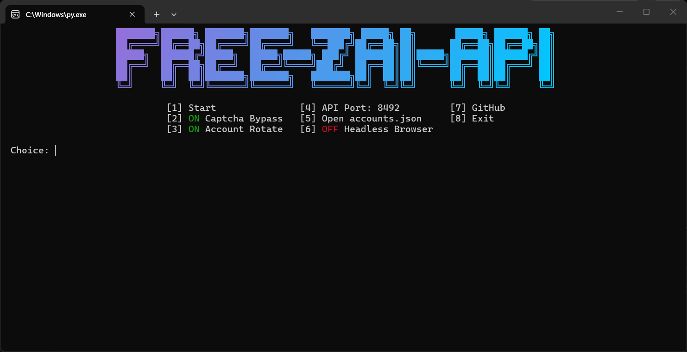

# Free-ZAI-Api




Self-hosted OpenAI-compatible API proxy for [chat.z.ai](https://chat.z.ai) (GLM-5.3 / GLM-5.2 / etc).
Runs a real browser session via **Playwright**, so the site sees a genuine Chrome fingerprint — the invisible Aliyun captcha passes automatically, no third-party captcha services needed.

> Built for use with [opencode](https://opencode.ai) and any other OpenAI-compatible client.

## How it works

```
client (opencode)                proxy (main.py)                  chat.z.ai
      │  POST /v1/chat/completions     │                               │
      │  {tools, messages, ...}        │                               │
      ├───────────────────────────────>│  Playwright browser session   │
      │                                ├──────────────────────────────>│
      │                                │   fresh chat + model select   │
      │                                │   invisible captcha auto-pass │
      │                                │<──────────────────────────────┤
      │<───────────────────────────────┤  SSE stream                   │
      │  OpenAI chunks                 │  (reasoning_content + content)│
```

- **Tool calling** — z.ai has no native function-calling over web chat, so the proxy injects tool schemas into the prompt and streams back the model's `<tc>NAME<ak>key</ak><av>value</av></tc>` responses as standard OpenAI `delta.tool_calls` (z.ai strips native `<tool_call>/<arg_key>/<arg_value>` tags from the stream, hence the custom `tc`/`ak`/`av` tags).
- **Account rotation** — round-robin between accounts from `accounts.json`.
- **Cooldown** — configurable delay between requests to avoid triggering captchas.
- **Popups** — promotional dialogs are closed automatically by a background watcher.
- **Startup screen** — plain printed output: banner, option table, the ` Choice: ` line, then the
  usage counters, and a single `CSI n A` afterwards to walk the caret back up to the prompt. The rows
  the move crosses are counted from the block that was just printed, so there is no cursor arithmetic
  that can drift. Two details are load-bearing:
  - a terminal narrower than the banner is asked to grow via XTWINOPS, and the wait is a poll on the
    actual width rather than a fixed pause. A fixed pause lost that race: the first frame was laid out
    against the old width and the banner came out clipped. The request is for the banner width plus a
    margin, so the logo is not flush against both edges either;
  - a counter row is printed one column short of the terminal width. A row that fills the width
    exactly leaves the cursor in pending-wrap, and the row count the caret move depends on stops being
    reliable.
- **Usage counters** — tokenised with `deepseek-tokenizer`, real token counts (prompt, completion,
  reasoning) next to character counts, split into `GLM Chat` and `GLM Reasoning`. They accumulate in
  `stats.json` next to the script, are reloaded on every start, and each row's bar shows that group's
  share of the same counter across everything, so `All` is always 100%. Tokenising happens on a
  background thread: a large prompt costs about a second, and the request should not wait for it. An
  empty or missing `stats.json` draws no block at all rather than a row of zeroes with full bars.
- **Scrolling the counters** — if they do not fit the window they are cut to it and the heading says
  so, as `Stats (scroll):`. The mouse wheel or `up`/`down` and `PageUp`/`PageDown` move the block one
  row at a time and the heading stays pinned. On Windows the wheel comes from the console as a mouse
  event rather than as characters, so mouse reporting is only switched on while there is something to
  scroll - that is what turns Quick Edit off, and with it off the terminal cannot select text; hold
  `Shift` while dragging to select anyway. A wheel step repaints the counter band in place and never
  clears the screen, otherwise reprinting the banner - a colour code per character - leaves a visible
  blank frame.

## Install

```bash
git clone https://github.com/lothiann/Free-ZAI-Api.git
cd Free-ZAI-Api
pip install -r requirements.txt
playwright install chromium
```

## Configure accounts

Get your auth token: open https://chat.z.ai → DevTools (`F12`) → Console:

```js
fetch('/api/v1/auths/').then(r=>r.json()).then(d=>window.__acc={id:d.id,email:d.email,name:d.name,token:d.token})
```
```js
copy(JSON.stringify(__acc))
```

Paste into `accounts.json`:

```json
{
  "rotate_every": 10,
  "accounts": [
    { "name": "main", "email": "you@gmail.com", "token": "eyJ..." }
  ]
}
```

| Field | Description |
|---|---|
| `token` | JWT from DevTools (**required**) |
| `rotate_every` | requests per account before switching to the next one |

## Run

```bash
python main.py
```

Server starts on `http://127.0.0.1:8492/v1`.

### Test

```bash
curl http://127.0.0.1:8492/v1/models

curl -N http://127.0.0.1:8492/v1/chat/completions \
  -H "Content-Type: application/json" \
  -d "{\"model\":\"glm-5.2\",\"stream\":true,\"messages\":[{\"role\":\"user\",\"content\":\"say OK\"}]}"

# account status
curl http://127.0.0.1:8492/accounts
```

## opencode

Add to `~/.config/opencode/opencode.jsonc` (or `opencode.json`):

```jsonc
{
  "provider": {
    "zai": {
      "npm": "@ai-sdk/openai-compatible",
      "name": "Z.AI (browser proxy)",
      "options": {
        "baseURL": "http://127.0.0.1:8492/v1",
        "apiKey": "sk-nothing"
      },
      "models": {
        "glm-5.3": { "name": "GLM-5.3", "limit": { "context": 2000000, "output": 2000000 } },
        "x-preview-l": { "name": "GLM-5.3 Flash", "limit": { "context": 2000000, "output": 2000000 } },
        "glm-5.2": { "name": "GLM-5.2", "limit": { "context": 2000000, "output": 2000000 } },
        "GLM-5-Turbo": { "name": "GLM-5 Turbo", "limit": { "context": 2000000, "output": 2000000 } },
        "GLM-5v-Turbo": { "name": "GLM-5v Turbo", "limit": { "context": 2000000, "output": 2000000 } },
        "glm-4.7": { "name": "GLM-4.7", "limit": { "context": 2000000, "output": 2000000 } },
        "glm-4.6v": { "name": "GLM-4.6v", "limit": { "context": 2000000, "output": 2000000 } },
        "GLM-4.1V-Thinking-FlashX": { "name": "GLM-4.1V Thinking FlashX", "limit": { "context": 2000000, "output": 2000000 } },
        "deep-research": { "name": "Deep Research", "limit": { "context": 2000000, "output": 2000000 } },
        "zero": { "name": "Zero", "limit": { "context": 2000000, "output": 2000000 } },
        "0727-106B-API": { "name": "0727 106B API", "limit": { "context": 2000000, "output": 2000000 } },
        "0727-360B-API": { "name": "0727 360B API", "limit": { "context": 2000000, "output": 2000000 } },
        "0808-360B-DR": { "name": "0808 360B DR", "limit": { "context": 2000000, "output": 2000000 } },
        "glm-4-flash": { "name": "GLM-4 Flash", "limit": { "context": 2000000, "output": 2000000 } },
        "glm-4-air-250414": { "name": "GLM-4 Air", "limit": { "context": 2000000, "output": 2000000 } }
      }
    }
  }
}
```

Models can also be discovered automatically from `/v1/models`, but listing them manually is more reliable.
Passing `reasoning: true` on a model enables default/high/max thinking-effort variants (mapped to the site's Deep Think control).

## Endpoints

| Endpoint | Description |
|---|---|
| `GET /v1/models` | model list parsed from the site |
| `POST /v1/chat/completions` | chat, streaming & non-streaming, with tools |
| `GET /accounts` | rotation status |

## Notes

- Each request opens a fresh site chat; full conversation history is forwarded as a single prompt.
- Reasoning is streamed via `delta.reasoning_content`, the answer via `delta.content`.
- Tool calls require the client to send standard OpenAI `tools`; results come back as `role: "tool"` messages.
- `usage` counts **characters** (1 token := 1 char), matching the site's ~2M real limit — set the model limit in your client accordingly (e.g. `context: 2000000`).
- Logs are written to `logs/`, the last raw response to `last_response.json`.

## Disclaimer

For personal / educational use. Automating chat.z.ai may violate its Terms of Service — use your own accounts at your own risk.
